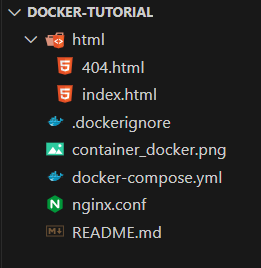

# Docker + Nginx

# 🐳


## En Windows Docker Desktop de estar corriendo

# 🚀
## Run Container 

```bash
 docker-compose up -d
```

## Stop Container

```bash
docker-compose down
```

## Stop and Run Container

```bash
docker-compose down && docker-compose up -d
```

---

## Estructura del proyecto



---

## docker-compose.yml

```yml

version: '3.8'

services:
nginx:
image: nginx:alpine
container_name: nginx-container
ports: - "8081:80"
volumes: - ./nginx.conf:/etc/nginx/nginx.conf - ./html:/usr/share/nginx/html
restart: unless-stopped

networks:
default:
name: nginx-network

```

---

## nginx.conf

```conf

events {
    worker_connections 1024;
}

http {
    include       /etc/nginx/mime.types;
    default_type  application/octet-stream;

    sendfile on;
    keepalive_timeout 65;

    server {
        listen 80;
        server_name localhost;
        root /usr/share/nginx/html;
        index index.html;

        location / {
            try_files $uri $uri/ /index.html;
        }

        error_page 404 /404.html;
        error_page 500 502 503 504 /50x.html;
        
        location = /50x.html {
            root /usr/share/nginx/html;
        }
    }
}


```

---


